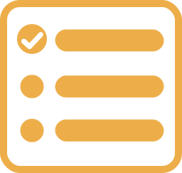

  
  <h1>PlanAhead</h1>
  
<strong>Simple and effective way to manage your daily tasks</strong>

## About

Application that allows users to create and manage their to-do lists. It provides a simple and user-friendly interface that makes it easy to add, manage and categorize tasks by priority and due date. The main goal of this app is to help users stay organized, focused, and on track with their daily tasks and responsibilities, ultimately increasing their productivity and helping them achieve their goals more effectively.

## Contributing

See [the contributing guide](CONTRIBUTING.md) for detailed instructions on how to get started with our project.
